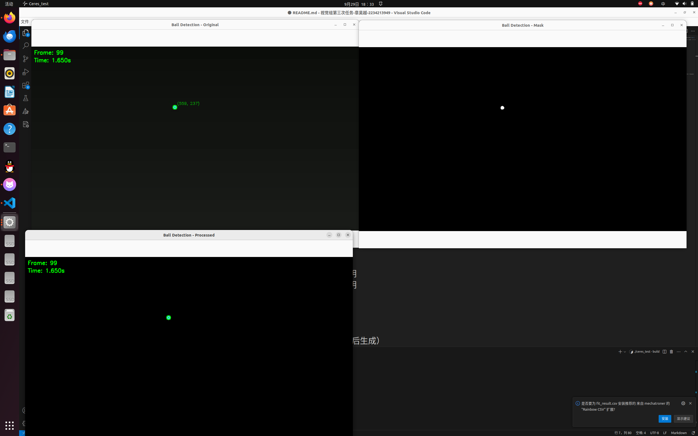
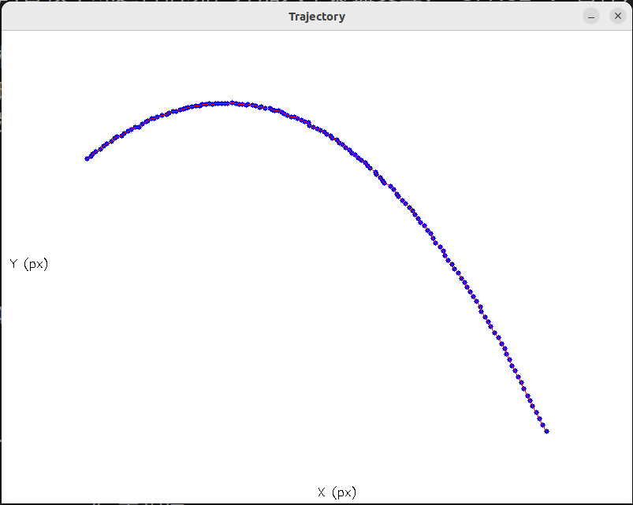
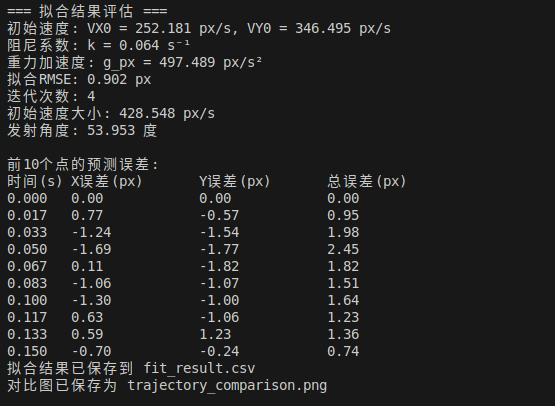
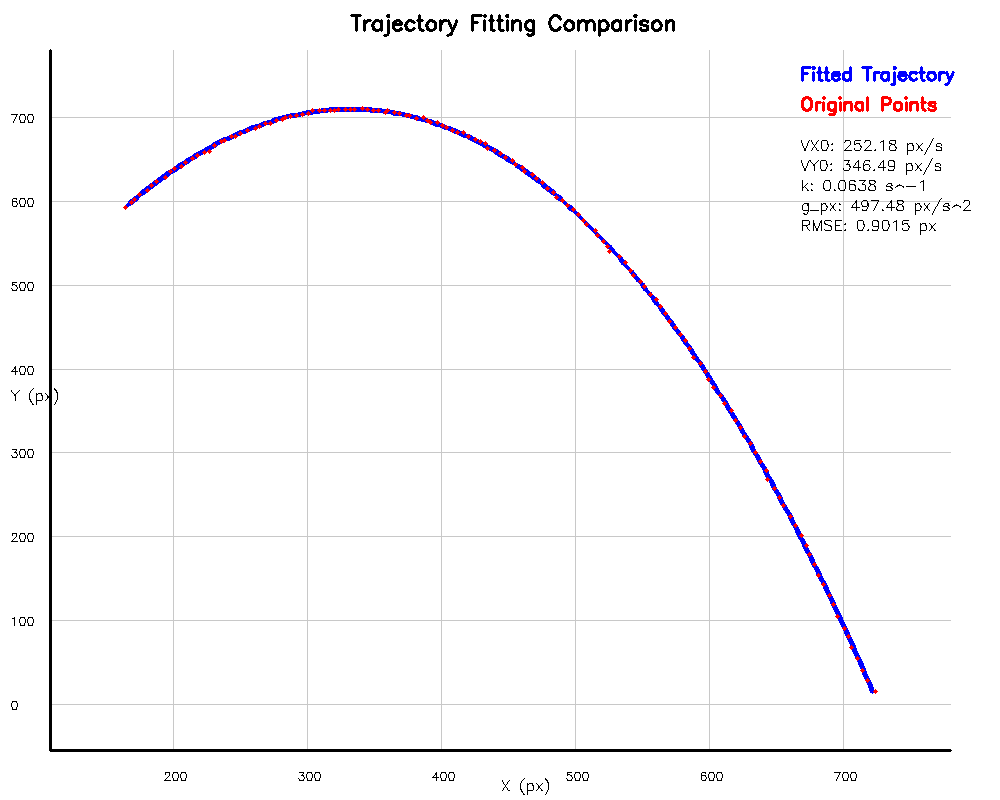

# 小球抛体运动轨迹拟合系统

---
## 项目概述
本项目基于 **OpenCV 计算机视觉处理**，实现了在黑色背景视频中检测天蓝色小球的运动轨迹，并使用 **Ceres 非线性优化库** 拟合带空气阻力的抛体运动模型。  

系统可视化功能包括：
- 展示小球原运行轨迹和处理后的各帧小球运行情况，并加入了键盘交互："SPACE": 暂停/继续；"ESC": 退出;"+": 加快速度;"-": 减慢速度。

- 在终端输出各帧检测情况，当检测到小球时，输出对应的时间和位置。

- 展示优化迭代过程，输出拟合的效率和拟合结果，并选取前10个点进行评估。

- 提供直观的可视化对比（原视频中各帧的点 VS 根据拟合结果的预测曲线）

---

## 项目结构
'''
视觉组第三次任务-章昊越-2234213949/
├── CMakeLists.txt              # 项目构建配置
├── include/                    # 头文件目录
│   ├── BallDetector.h         # 小球检测类声明
│   └── TrajectoryFitter.h     # 轨迹拟合类声明
├── src/                       # 源文件目录
│   ├── main.cpp              # 主程序
│   ├── BallDetector.cpp      # 小球检测实现
│   └── TrajectoryFitter.cpp  # 轨迹拟合实现
├── build/                    # 构建目录（编译后生成）
└── README.md                # 项目说明文档
'''

---
## 系统架构

### 三个阶段处理流程

#### 第一阶段：小球检测与轨迹提取
- 使用 OpenCV 进行视频帧处理  
- HSV 颜色空间检测天蓝色小球  
- 亚像素精度定位小球中心  
- 坐标系转换（Y 轴向上为正）  

#### 第二阶段：物理模型拟合
- 使用 Ceres 库进行非线性优化  
- 拟合带空气阻力的抛体运动模型  
- 四参数优化 `[VX0, VY0, k, g_px]`  
- 参数边界约束和数值稳定性处理  

#### 第三阶段：结果可视化与对比
- 原始轨迹与拟合曲线对比显示  
- 拟合质量评估和参数输出  
- 误差分析和结果保存  

### 拟合参数

| 参数  | 物理意义     | 单位  | 约束范围      |
|-------|--------------|-------|---------------|
| VX0   | 初始水平速度 | px/s  | 无约束        |
| VY0   | 初始垂直速度 | px/s  | 无约束        |
| k     | 阻尼系数     | s⁻¹   | [0.01, 1.0]   |
| g_px  | 像素空间重力加速度 | px/s² | [100, 1000] |

---
## 环境要求

### 系统依赖
- Ubuntu 18.04 或更高版本  
- CMake 3.10+  
- C++11 兼容编译器  

# XJTU-25RMV-Task03
